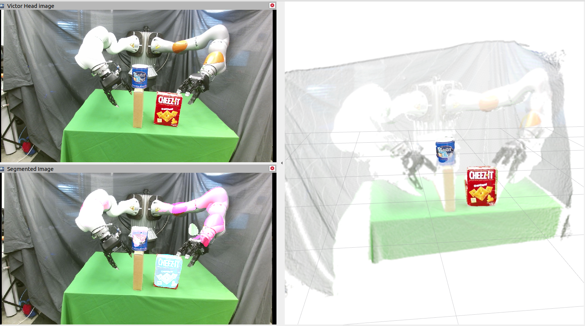

# ROS YCB Object Segmentation
This package provides an out-of-the-box ROS solution for segmenting YCB objects from a RGB camera and optionally republishing the segmented portion of a point cloud, if a depth image is provided.

## How to use
1. start the kinect: In the ARM Lab this can be done by: 

       ssh loki
       roslauch mps_launch_files kinect_vicon_real_robot.launch pov:="victor_head"
    
2. launch `roslaunch object_segmentation ycb_segmentation.launch objects:="1 2 3"`
3. View the results in rviz by opening the `segmented_view.rviz` config

The results:

The kinect publishes to a namespace (e.g. `/kinect2_victor_head/qhd/...`) specified in the launch file. 

This packages adds on several new topics to that namespace:
- `marked_image` the original image with colorful markings of the segmentation
- `segmentation_mask` a mask where each pixel has the value of the inferred object category
- `segmented_pointcloud` with just the points matching the object categories specified when launching

# Installation

This repo is based on and uses https://github.com/CSAILVision/semantic-segmentation-pytorch

First, install the prereqs: 
https://github.com/CSAILVision/semantic-segmentation-pytorch#integration-with-other-projects

# Pretrained Models
The pretrained model for YCB objects should be downloaded automatically the first time you run this script. If not, manually downloaded the pretrained model to the `ckpt` directory:
https://drive.google.com/file/d/17eV88dp33_Kxqt3ke_C1DoRICeOICh-4/view?usp=sharing

# The segmentation is not good enough!
To train your own model, check out [my other github repo](https://github.com/bsaund/semantic-segmentation-pytorch)
